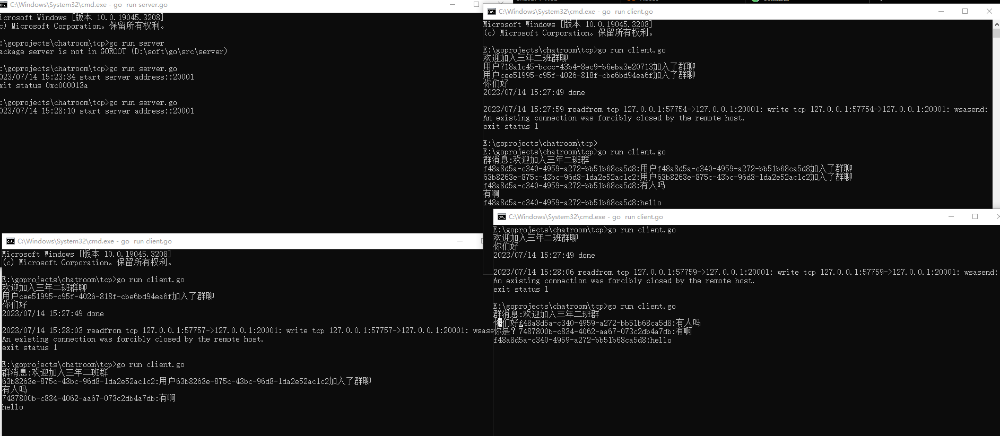

## 用tcp实现群聊
关键代码：tcp文件夹下

### 实现思路
关键点：理解利用管道来传输各种类型数据避免加锁

相关管道：
- 连接管道：连接进来时，为这个连接分配一个管道。单独开一个协程监听此管道，有消息则发送给客户端
- 群聊相关管道：进入管道、离开管道、消息管道
- 服务启动后接收连接前，开启一个协程监听群聊相关的管道
  - 收到进入群聊消息、将用户信息保存到map
  - 收到退出群聊消息、map中用户信息剔除、同时关闭用户对应的channel
  - 收到消息后将消息发送给所有用户id与消息uid不同的用户

大致流程
- 开启tcp服务、监听端口。
- 开启新协程监听群聊相关管道
- 死循环获取连接，拿到连接后交给另外一个协程处理连接
- 处理连接逻辑
  - 收到连接后构建用户信息（实际中应该通过请求路径参数获取用户信息）
  - 向群进入管道、群消息管道发送消息
  - 为用户分配管道，开启新的协程监听此管道，当收到消息后发送给客户端
  - 向用户消息管道发送欢迎消息
  - 循环读取客户端发送的消息、发送到群消息管道
  - 循环退出（客户端断开），向群退出管道、群消息管道发送消息

测试

打开tcp所在文件夹，启动server与多个client

